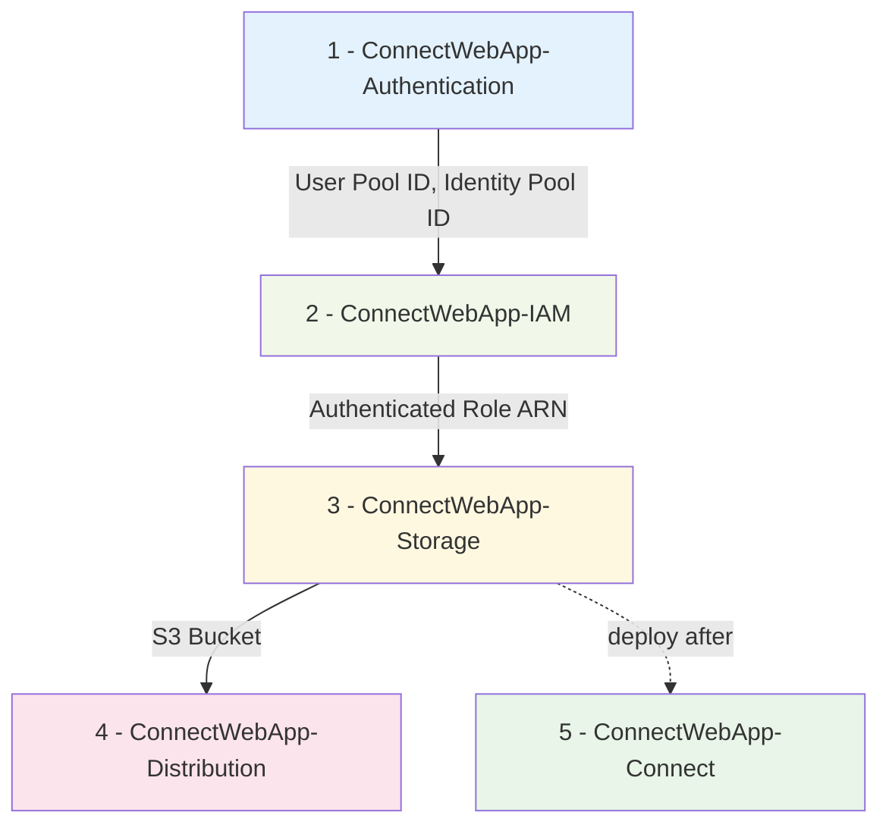

# CDK Stacks

This solution uses independent stacks with cross-stack references instead of nested stacks for:
- **Parallel deployment**: Storage + Connect deploy simultaneously
- **Independent updates**: Update individual stacks without affecting others
- **Deployment flexibility**: Use `--all` flag for single command deployment
- **Simpler maintenance**: Clear separation of concerns without nested complexity

**Deployment Order (Automatic):**
1. **ConnectWebApp-Authentication**: Cognito User Pool + Identity Pool (no dependencies)
2. **ConnectWebApp-IAM**: Authenticated role policies — `connect:StartWebRTCContact`, `connect:DescribeContact`, `connect:StopContact`, `connectparticipant:DisconnectParticipant` (depends on `ConnectWebApp-Authentication`)
3. **ConnectWebApp-Storage**: S3 bucket for static web hosting (depends on `ConnectWebApp-IAM`)
4. **ConnectWebApp-Distribution**: CloudFront + OAC, CSP headers incl. `wss://*.chime.aws` (depends on `ConnectWebApp-Storage`)
5. **ConnectWebApp-Connect**: Contact flows — `webrtc-queue-routing`, `chat-agent-routing` (no dependencies; deployment ordered after `ConnectWebApp-Storage`)
