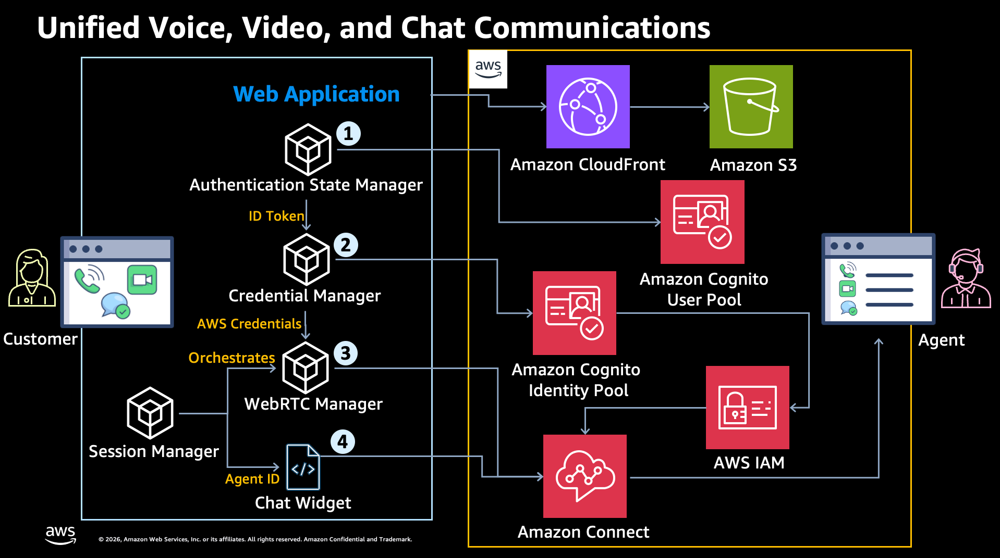
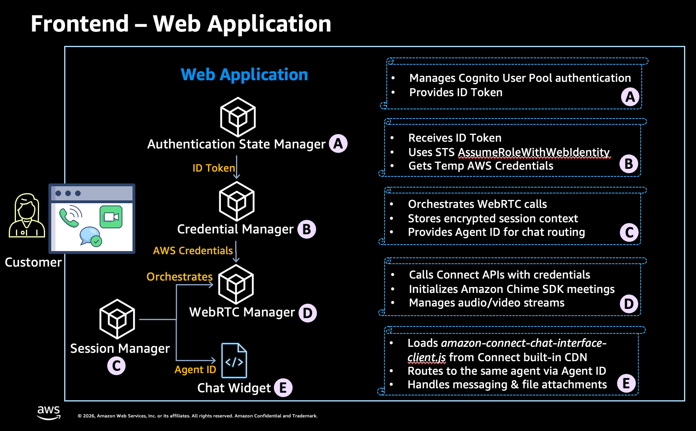
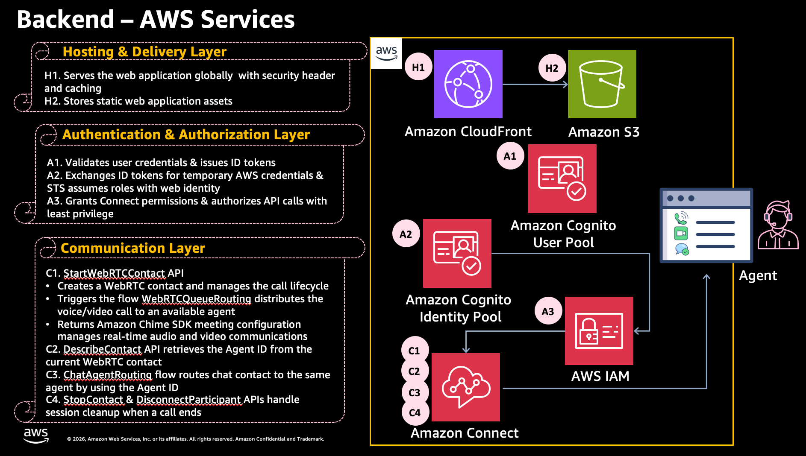
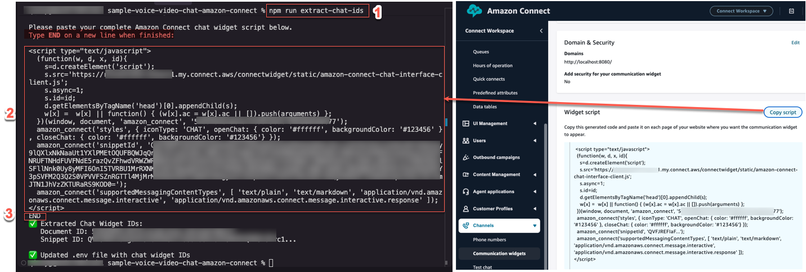

# Build Unified Voice, Video, and Chat Communications with Amazon Connect

Discover how to build a unified customer engagement solution using Amazon Connect.

A customer can interact with an agent through voice, video, and chat — all at the same time. Agents can manage all three channels simultaneously. During a live video call, both the agent and the customer can exchange documents. While talking, they can also send text messages to each other in real time.

The entire solution is deployed and managed using AWS CDK.

## ⚠️ Important Notice

**This is sample code for educational and demonstration purposes only.**

This sample code is provided as-is under the MIT-0 license. You should not use this code in production without proper testing, security hardening, and compliance validation based on your organizational requirements.

For production deployment, work with your security and legal teams to ensure the solution meets your organizational security, regulatory, and compliance requirements.

## Features

- WebRTC voice/video calling with Amazon Chime SDK for JavaScript
- Amazon Connect Chat Widget with agent routing
- Secure authentication via Amazon Cognito
- Infrastructure as Code with AWS CDK and TypeScript

## Architecture

Web application providing WebRTC voice/video calling and chat. Customers authenticate via Cognito, place WebRTC calls through Amazon Connect with Chime SDK for client-side media, and open chat sessions routed to the same agent.



### Web Application to AWS Services

**CloudFront** serves the application globally with security headers and caching. **S3** stores static assets. You can also test locally.

1. **Authentication State Manager** connects to **Cognito User Pool**. Customer enters credentials, Cognito validates and issues ID Token.

2. **Credential Manager** passes ID Token to **Cognito Identity Pool**, which calls **STS AssumeRoleWithWebIdentity**. **IAM role** grants least-privilege Connect permissions, returning temporary credentials. Frontend never holds long-lived secrets.

3. Customer starts voice/video call: **Session Manager** orchestrates, **WebRTC Manager** calls **Connect StartWebRTCContact** API. Backend triggers **WebRTCQueueRouting** flow, routes to available agent, returns **Chime SDK** config. Frontend initializes Chime SDK and manages real-time streams. Frontend calls **Connect DescribeContact** API to get Agent ID, stores in **Session Manager**. On call end, frontend calls **Connect StopContact** and **Connect Participant Service DisconnectParticipant** APIs.

4. Customer opens **Chat Widget**: **Session Manager** passes Agent ID to widget (loads from `https://{instanceAlias}.my.connect.aws/connectwidget/static/amazon-connect-chat-interface-client.js`). Widget adds `amazon_connect('contactAttributes', {AgentId})`, hits **ChatAgentRouting** flow, routes to same agent. This unifies voice, video, and chat into one agent experience.

### Web Application Components



### Backend AWS Services



### Project Structure

See [PROJECT_STRUCTURE.md](PROJECT_STRUCTURE.md).

### Configuration

Manage via `.env` file. Generated files:
- `public/config.json` - Runtime config
- `lib/config/cdk-infrastructure-config.json` - CDK config

## Deployment
### Prerequisites

- Node.js 18+, TypeScript 5.3+
- [AWS account](https://docs.aws.amazon.com/accounts/latest/reference/manage-acct-creating.html) and [security credentials](https://docs.aws.amazon.com/IAM/latest/UserGuide/security-creds.html)
- [AWS CLI](https://docs.aws.amazon.com/cli/latest/userguide/cli-chap-getting-started.html) installed and configured
- [AWS CDK](https://docs.aws.amazon.com/cdk/v2/guide/getting-started.html) installed
- Amazon Connect instance with [file attachments enabled](https://docs.aws.amazon.com/connect/latest/adminguide/enable-attachments.html) 

### Step I: Environment Isolation

```bash
cd <your-project-path>
npm install aws-cdk@latest
npx aws-cdk --version
```

### Step II: Install dependencies
```bash
npm install
```

### Step III: Configure environment
```bash
cp .env.example .env
# Edit .env: AWS_ACCOUNT_ID, AWS_REGION, AMAZON_CONNECT_INSTANCE_ID, AMAZON_CONNECT_INSTANCE_ALIAS, AMAZON_CONNECT_QUEUE_ID (BasicQueue ID in the Amazon Connect instance)
# Other parameters auto-populate after deployment
```

**Create Communication Widget:**
1. Amazon Connect Console → **Channels** → **Communication widgets** → **Add widget**
2. **Name:** ChatWidget
3. **Chat contact flow:** Choose any (will change later)
4. **Save and continue** (twice)
5. **Add domains:** `http://localhost:8080` (add CloudFront domain after deployment)
6. **Security:** Select "No - I do not want to enable JWT security measures for this widget"
7. **Save and continue**
8. **Copy script** next to "Widget script" and save

**Extract Widget IDs:**
1. Run:
   ```bash
   npm run extract-chat-ids
   ```
2. Paste your complete chat widget script, press Enter
3. Type "END" on a new line
4. Verify chat widget IDs added to .env
   

### Step IV: Generate CDK configuration
```bash
npm run generate-cdk-config
```

### Step V: Generate contact flows
```bash
npm run update-contact-flows
```
Note: Required before bootstrap/deploy. CDK validates `contact-flows/generated` directory.

### Step VI: Check environment setup
```bash
npm run check-env
```
Validates environment variables, configuration files, and contact flows.

### Step VII: Bootstrap CDK (first time only)
```bash
npx aws-cdk bootstrap aws://ACCOUNT-ID/REGION
```

### Step VIII: Deploy
```bash
npm run cdk:deploy  # Wait 10-15 minutes
npm run deploy-to-s3
```

## Deployed CDK Stacks

See [CDK_STACKS.md](CDK_STACKS.md) for stack architecture, dependency diagram, and deployment order.

## Post-Deployment: Manual Steps

### Step I: Update Basic Routing Profile
1. Enable Voice and Chat channels in your routing profile
2. Configure cross-channel concurrency: Change Voice setting to "Allow other channels concurrently"
3. Add BasicQueue with both Voice and Chat enabled
4. Save and assign agents to Basic Routing Profile

### Step II: Configure Chat Widget and Contact Flow
1. Link "ChatAgentRouting" contact flow to your chat widget
2. Add CloudFront domain to chat widget allowed domains
   - Get from CDK output: `DistributionDomainNameOutput` (ConnectWebApp-Distribution stack)
   - Example: `https://dxxxxxx.cloudfront.net`

### Step III: Create Test User
Create Cognito user:
```bash
aws cognito-idp admin-create-user \
  --user-pool-id <YOUR_USER_POOL_ID> \
  --username <USERNAME> \
  --user-attributes Name=email,Value=<EMAIL> Name=email_verified,Value=true Name=name,Value="<DISPLAY_NAME>" \
  --temporary-password "<PASSWORD>" \
  --region <REGION>

aws cognito-idp admin-set-user-password \
  --user-pool-id <YOUR_USER_POOL_ID> \
  --username <USERNAME> \
  --password "<PASSWORD>" \
  --permanent \
  --region <REGION>
```

**Parameters:**
- `<YOUR_USER_POOL_ID>`: From CDK output `UserPoolIdOutput` (ConnectWebApp-Authentication)
- `<USERNAME>`: e.g., `nikkiwolf`
- `<EMAIL>`: e.g., `nikki.wolf@example.com`
- `<DISPLAY_NAME>`: e.g., `Nikki Wolf`
- `<REGION>`: e.g., `us-east-1`

**Example:**
```bash
aws cognito-idp admin-create-user \
  --user-pool-id us-east-1_ABC123DEF \
  --username nikkiwolf \
  --user-attributes Name=email,Value=nikki.wolf@example.com Name=email_verified,Value=true Name=name,Value="Nikki Wolf" \
  --temporary-password 'Password#1234' \
  --region us-east-1

aws cognito-idp admin-set-user-password \
  --user-pool-id us-east-1_ABC123DEF \
  --username nikkiwolf \
  --password 'Password#1234' \
  --permanent \
  --region us-east-1
```

### Step IV: Enable Video Calls
In agent's security profile under "Contact Control Panel (CCP)", enable:
- Access Contact Control Panel
- Audio device settings
- Video calls


## Testing

1. Open CloudFront URL from CDK output: `DistributionDomainNameOutput` (e.g., `https://dxxxxxx.cloudfront.net`)
2. Log in with the Cognito user's email address
3. Open Amazon Connect agent CCP in another tab, set status to **Available**
4. Click **Start Voice Call** or **Start Video Call** — agent receives the contact
5. After agent answers, click **Start Chat with the Same Agent** — chat widget routes to same agent
6. Now you have simultaneous voice/video and chat with one agent. Exchange messages and files in real time

### Local Testing (Optional)
1. Add `http://localhost:8080` to chat widget allowed domains
2. Run:
   ```bash
   npm start
   ```
3. Open `http://localhost:8080`

Note: Change port by updating `PORT` in `.env`.
server.js is only for local development/testing. It's a simple Node.js HTTP server, not used for the CloudFront deployment. 

## Cleanup

1. Delete chat widget: Amazon Connect Console → **Channels** → **Communication widgets**
2. Destroy CDK stacks:
   ```bash
   npx aws-cdk destroy --all --force
   ```

## Security Considerations

See [THREAT_MODEL.md](THREAT_MODEL.md).
